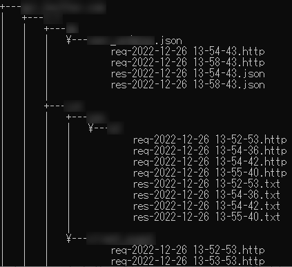

# Fidder で iOS Packet-Sniffing する

https://qiita.com/tokawa-ms/items/43624d536a44f60882cb

Android でも試そうとしたが、Android 7 からシステム証明書しか信頼できる証明書として使わなくなったらしく、ブラウザしかユーザー証明書を見ないので Android ではルート化せずに Packet Sniffing できないらしい。

https://android-developers.googleblog.com/2016/07/changes-to-trusted-certificate.html

## Environment

- Windows 10 22H2 (Build 19045.2251)
- iPad Pro 3 (11 inch) / iPadOS 16
- Telerik Fidder Classic v5.0.20211.51073
- FidderCertMaker

## Windows にソフトをインストール

以下をインストール

### Fidder Classic

安直に Scoop 経由でインストールすると CertMaker インストール時にコケるので、インストーラを使う。  
Fiddler Everywhere なる新しいソフトが出ているが、こちらでは期待する動作はしないと思うので Classic を使う。

https://www.telerik.com/fiddler/fiddler-classic

### CertMaker for iOS and Android

https://www.telerik.com/fiddler/add-ons

## Fiddler の設定

Tools -> Options

### HTTPS タブ

- [x] Capture HTTPS CONNECTs
- [x] Decrypt HTTPS traffic
- [x] Ignore server certificate errors (unsafe)
- Protocols: `<client>;ssl3;tls1.0;tls1.1;tls1.2`

### Connections タブ

- [x] Allow remote computers to connect

## iOS に証明書をインストール

`http://host:8888/` にアクセス、`You can download the FidderRoot certificate` からダウンロードしインストールする。

1. 「この Web サイトは構成プロファイルをダウンロードしようとしています。許可しますか？」->「許可」
2. 「プロファイルがダウンロードされました」
3. 設定アプリケーションを開き、一般タブ -> VPN とデバイス管理 -> ダウンロード済みプロファイルの `DO_NOT_TRUST_FiddlerRoot` をタップ
4. 「インストール」
5. インストールが完了したら、一般タブ -> 情報 -> 証明書信頼設定 -> ルート証明書を全面的に信頼する -> `DO_NOT_TRUST_FiddlerRoot` をオン
6. ルート証明書をアクティブにすることの警告が出るので、「続ける」

## プロキシ設定

Wi-Fi タブから、接続中の AP のインフォメーションボタンをタップ。下にスクロールし「HTTP プロキシ」欄の「プロキシを構成」に入る。  
「手動」に切り替え、「サーバ」に Windows PC の IP 、「ポート」に `8888` を入れる。認証はオフ。

## Tips: 通信レスポンスを全部ファイル保存

FiddlerScript タブから、以下のスクリプトを追加する。  
FiddlerScript は JScript.NET らしい…。

```js
static function OnBeforeResponse(oSession: Session) {
    if (!oSession.HTTPMethodIs("CONNECT") && oSession.responseCode == 200) {
        var directoryPath = "/path/to/dir/"
        var reqPath = oSession.hostname + RemoveRight(oSession.PathAndQuery, "?").Replace(":", "-") + "/req-" + oSession.Timers.ClientBeginRequest.ToString().Replace("/", "-").Replace(":", "-") + ".http"
        var resPath = oSession.hostname + RemoveRight(oSession.PathAndQuery, "?").Replace(":", "-") + "/res-" + oSession.Timers.ClientBeginRequest.ToString().Replace("/", "-").Replace(":", "-") + "." + RemoveLeft(oSession.SuggestedFilename, ".")
        oSession.utilDecodeRequest()
        oSession.SaveRequest(directoryPath + reqPath, false)
        oSession.utilDecodeResponse()
        oSession.SaveResponseBody(directoryPath + resPath)
    }
}

static function RemoveRight(str: String, removeStr: String) {
    var length = str.IndexOf(removeStr)
    if (length < 0) {
        return str
    }
    return str.Substring(0, length)
}

static function RemoveLeft(str: String, removeStr: String) {
    var length = str.IndexOf(removeStr)
    if (length < 0) {
        return str
    }
    return str.Substring(length + 1)
}
```

これを入れて `Save Script` でセーブすると、以下のように出力される。



## やめるとき

### プロキシ設定の削除

Wi-Fi タブから、接続中の AP のインフォメーションボタンをタップ。下にスクロールし「HTTP プロキシ」欄の「プロキシを構成」に入る。  
「オフ」に切り替え。必要があれば「自動」に切り替え。

### 証明書のアンインストール

設定アプリケーションを開き、一般タブ -> VPN とデバイス管理 -> ダウンロード済みプロファイルの `DO_NOT_TRUST_FiddlerRoot` をタップ  
「プロファイルを削除」で削除。
