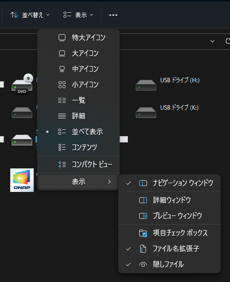
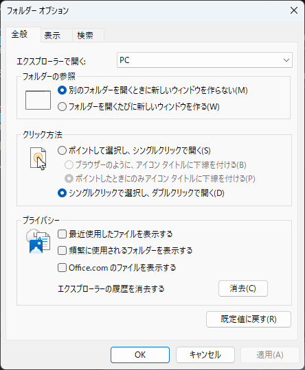

# 自分用PCセットアップ関連メモ

!!! note "注意事項"
    本メモの内容に起因して生じた、あらゆる損害や障害について一切の責任を負いません。

## 環境

- Windows 11
  - Home 22H2 (Build 22621.1702)
  - Pro 22H2 (Build 22621.1192)

## クリーンインストールをする前に…

[初期化前に行う作業](before-reset.md) を必ず確認し実施。

## インストールメディアの作成

Windows のクリーンインストールにあたり、インストールメディア（USB メモリ）を作成しておくと良い。  
（回復オプションからリセットできるが、パーティション全部消して入れ直した方が綺麗になると思っている）

Microsoft の [Windows 11 をダウンロードする](https://www.microsoft.com/ja-jp/software-download/windows11) にアクセスし、`Windows 11 のインストールメディアを作成する` からツールをダウンロード。  
ダウンロードしたメディア作成ツールを実行して、インストールメディアを作成する。

## BIOS/UEFI の設定

参考: https://michisugara.jp/csm_secureboot

Windows 11 ではセキュアブートが必須になった。BIOS（UEFI）にてこの設定を有効化する必要があるのだが、どういう設定をすればいいか厄介なので一応メモ。

- CSM を無効にする（Windows 7 以下が実行不可になる？）
- Secure Boot を有効にする（起動時にデジタル署名をチェックする）
- 間違っても両方を有効にはしない
- ASUS のマザーボードなら起動設定（Boot）にある

## インストール

参考: https://www.ask-corp.jp/guide/pc-diy-part4.html

PCを起動する前に、Windows をインストールしたいストレージ以外のケーブルを外しておく。  
パーティションを削除するときにどのパーティションかわからなくなるので、絶対に外しておくのが吉。

BIOS/UEFI に入り、起動順を変えてインストールメディアとして作成した USB メモリで起動する。Windows 11 のインストーラーが起動するはず。  
インストーラーが起動したら、以下の手順でインストールする。

1. `今すぐインストール` をクリック
2. `Windows のライセンス認証` の画面に移動する。クリーンインストールの場合ハードウェアの情報を使って認証するので、`プロダクトキーがありません` をクリック
3. インストールするオペレーティングシステムを選ぶ画面になる。正しいエディションを選ぶ
4. ライセンス条項に同意して `次へ`
5. 下の `カスタム` を選ぶ
6. すべてのパーティションを削除（パーティションを選んで `削除`）し、1 つの `割り当てられていない領域` にする。
7. `割り当てられていない領域` を選択した状態で、`新規` をクリックしパーティションを作成する（この手順要らないかも）
8. Windows 11 のインストールが始まる

## インストール時の初期設定

参考: https://a-zs.net/win11_msaccountkaihi/

Windows 11 のインストール処理が終わると、国や地域を選ぶ画面が表示される。

Microsoft アカウントを利用するならこのまま進んでも良いが、ローカルアカウントを利用するなら以下の手順を踏む（Windows 11 Home でも実施可能）

1. ++shift+f10++ でコマンドプロンプトを起動する
2. `oobe\ByPassNRO.cmd` と打ち込み、実行する。自動で再起動される
3. LAN ケーブルを刺している場合は抜く
4. セットアップを進める（国の設定とキーボードレイアウトの設定の後）と、ネットワークに接続することを要求される。この画面で、`インターネットに接続していません` というボタンが利用できるのでこれをクリック
5. `今すぐ接続して、デバイスをすぐに使い始めましょう` という画面が出るが、`制限された設定で続行` をクリック

その後、以下の設定が表示されるので適宜進める。

- `このデバイスを使うのはだれですか？`: ここで入力した文字列がユーザー名となる。大文字小文字が識別され、ユーザーフォルダともなるので注意。アルファベットで小文字を推奨
- `確実に覚えやすいパスワードを作成します`: ログイン時のパスワードを設定
- 秘密の質問: 適宜設定
- `デバイスのプライバシー設定の選択`: お好きにだが、すべてオフ（拒否）で良い

デスクトップが表示されれば、Windows 11 のインストールと初期設定は完了。  
この後は利便性を上げるための設定をする。

## Windows Update の実施

デバイスドライバーなどの関係で、この段階で Windows Update をしておくのが良い。  
Windows Update で入らないドライバーは別途インストールを行う。

## Windows を使う上での推奨設定

Windows を使う上での個人的なおすすめ設定を行う。

### デバイス名の変更

`システムのプロパティ`（`SystemPropertiesComputerName.exe`）の `コンピューター名/ドメイン名の変更` で変更する。  
変更後は再起動が必要で、デバイス名は Firefox が利用するので最初にやったほうがよい。

コマンドラインからも変更可能。**管理者権限で** PowerShell を開いて以下を実行。

```powershell
wmic computersystem where name="%computername%" call rename name="<COMPUTER-NAME>"
wmic computersystem where name="%computername%" call joindomainorworkgroup name="<WORKSPACE-NAME>"
```

### エクスプローラの設定

まず、隠しフォルダ・ファイルと拡張子を表示する設定をする。

エクスプローラを開き、上部ナビゲーションバーの `表示` から `表示` を開き、以下の設定をする。

- [x] `ファイル名拡張子`
- [x] `隠しファイル`



さらに、`・・・` から `オプション` を開き、以下の設定も行う。

- `全般` タブ
  - `エクスプローラーで開く`: `PC`
  - `プライバシー`
    - [ ] `最近使用したファイルを表示する`
    - [ ] `頻繁に使用されるフォルダーを表示する`
    - [ ] `Office.com のファイルを表示する`



### タスクバーの設定

- 左側に寄せる
- 検索窓を消す
- 要らないショートカットを消す

### テーマの設定

### ユーザーフォルダの移動

### クリップボードの履歴機能を有効化

### ウインドウを選ぶ時に全画面プレビューされないようにする

### Windows の通知サウンドを切る

### 通信アクティビティの設定

## ソフトウェアのインストールや設定

適宜別ページへ。

### アンチウイルスソフト

### Firefox

### Chrome

### Opera

### Scoop

### Terminal

### Pwsh

### EarTrumpet

### Thunderbird

### Logicool G HUB

### AnyDesk

### その他ソフトウェア

### Windows SandBox, Hyper-V

### Windows Subsystem for Linux

### Docker Desktop

- SSH Agent
- OpenSSL のアップデート

### BlueStacks
